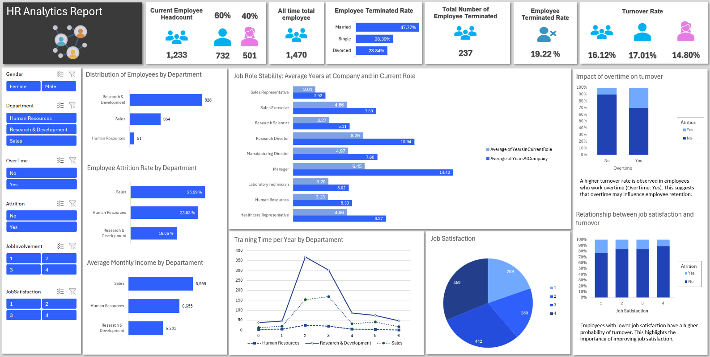

# 📊 HR Analytics Dashboard

This project delivers a comprehensive **Human Resources (HR) analytics dashboard** built in **Microsoft Excel**, designed to analyze workforce data and support data-driven decision-making. It includes interactive visualizations, employee turnover insights, gender distribution, salary analysis, and tenure breakdown using advanced Excel tools such as pivot tables, charts, and DAX formulas.

---

## 📁 Project Structure

- `db` → Employee database with individual-level data  
- `reports` → Pivot tables summarizing key workforce indicators  
- `dashboard` → Interactive dashboard with dynamic visuals and slicers  

---

## 📊 Metrics Analyzed

- **Total employees**
- **Active employees**
- **Terminated employees**
- **Termination rate**
- **Gender distribution**
- **Turnover rate by gender**
- **Average age**

---

## 🛠 Tools Used

- **Microsoft Excel**
  - Pivot Tables  
  - Pivot Charts  
  - Slicers and Filters  
  - Conditional Formatting  
  - Interactive Dashboards  
- **DAX (Data Analysis Expressions)**  
  Used to calculate custom measures such as:
  - Total employee
  - Headcount
  - Termination
  - Termination rate (%)
 
---

## 🎯 Project Goals

- Monitor organizational health with key HR indicators  
- Identify turnover trends and workforce stability  
- Analyze employee tenure and experience  
- Provide decision-makers with actionable, data-driven insights  

---

## 📷 Dashboard Preview

---

## 🚀 How to Use

1. Open the Excel file.
2. Go to the `dashboard` sheet.
3. Use the slicers to filter by gender, department, or other fields.
4. Explore the `reports` sheet for underlying pivot tables and calculations.

---

## 👨‍💻 Author

**Heriberto**  
GitHub: https://github.com/herbertturpo 

---
